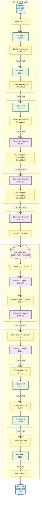

```mermaid
graph TD
    %% ノードのスタイル定義
    classDef input fill:#e1f5fe,stroke:#01579b,stroke-width:2px;
    classDef output fill:#e1f5fe,stroke:#01579b,stroke-width:2px;
    classDef conv fill:#fff9c4,stroke:#fbc02d,stroke-width:2px;
    classDef resblock fill:#e8f5e9,stroke:#2e7d32,stroke-width:2px;
    classDef evit fill:#f3e5f5,stroke:#7b1fa2,stroke-width:2px;
    classDef latent fill:#ffebee,stroke:#c62828,stroke-width:2px,stroke-dasharray: 5 5;

    subgraph Encoder [エンコーダ Encoder]
        direction TB
        Input[("入力動画<br/>(3ch)")]:::input
        
        %% Project In
        Enc_In["Conv3d (3→128)"]:::conv
        Input --> Enc_In

        %% Stage 0
        subgraph Enc_Stage0 [Stage 0]
            Enc_S0_Blk["ResBlock x2<br/>(128ch)"]:::resblock
            Enc_S0_Down["Spatial Downsample<br/>Conv (1,2,2)"]:::conv
        end
        Enc_In --> Enc_S0_Blk --> Enc_S0_Down

        %% Stage 1
        subgraph Enc_Stage1 [Stage 1]
            Enc_S1_Blk["ResBlock x2<br/>(256ch)"]:::resblock
            Enc_S1_Down["Spatial Downsample<br/>Conv (1,2,2)"]:::conv
        end
        Enc_S0_Down -- "(T, H/2, W/2)" --> Enc_S1_Blk --> Enc_S1_Down

        %% Stage 2
        subgraph Enc_Stage2 [Stage 2]
            Enc_S2_Blk["ResBlock x2<br/>(512ch)"]:::resblock
            Enc_S2_Down["Spatial Downsample<br/>Conv (1,2,2)"]:::conv
        end
        Enc_S1_Down -- "(T, H/4, W/4)" --> Enc_S2_Blk --> Enc_S2_Down

        %% Stage 3
        subgraph Enc_Stage3 [Stage 3]
            Enc_S3_Blk["EfficientViT Block x3<br/>(512ch)"]:::evit
            Enc_S3_Down["Spatiotemporal Downsample<br/>Conv (2,2,2)"]:::conv
        end
        Enc_S2_Down -- "(T, H/8, W/8)" --> Enc_S3_Blk --> Enc_S3_Down

        %% Stage 4
        subgraph Enc_Stage4 [Stage 4]
            Enc_S4_Blk["EfficientViT Block x3<br/>(1024ch)"]:::evit
            Enc_S4_Down["Spatiotemporal Downsample<br/>Conv (2,2,2)"]:::conv
        end
        Enc_S3_Down -- "(T/2, H/16, W/16)" --> Enc_S4_Blk --> Enc_S4_Down

        %% Stage 5
        subgraph Enc_Stage5 [Stage 5]
            Enc_S5_Blk["EfficientViT Block x3<br/>(1024ch)"]:::evit
        end
        Enc_S4_Down -- "(T/4, H/32, W/32)" --> Enc_S5_Blk

        %% Project Out
        Enc_Out["Conv3d (1024→128)"]:::conv
        Enc_S5_Blk --> Enc_Out
    end

    %% Latent Space
    Latent[("潜在表現 (Latent)<br/>(128ch, T/4, H/32, W/32)")]:::latent
    Enc_Out --> Latent

    subgraph Decoder [デコーダ Decoder]
        direction TB
        
        %% Project In
        Dec_In["Conv3d (128→1024)"]:::conv
        Latent --> Dec_In

        %% Stage 5 (Decoder starts from deep semantic layers)
        subgraph Dec_Stage5 [Stage 5]
            Dec_S5_Blk["EfficientViT Block x3<br/>(1024ch)"]:::evit
        end
        Dec_In --> Dec_S5_Blk

        %% Stage 4
        subgraph Dec_Stage4 [Stage 4]
            Dec_S4_Up["Spatiotemporal Upsample<br/>(2,2,2)"]:::conv
            Dec_S4_Blk["EfficientViT Block x3<br/>(1024ch)"]:::evit
        end
        Dec_S5_Blk --> Dec_S4_Up --> Dec_S4_Blk

        %% Stage 3
        subgraph Dec_Stage3 [Stage 3]
            Dec_S3_Up["Spatiotemporal Upsample<br/>(2,2,2)"]:::conv
            Dec_S3_Blk["EfficientViT Block x3<br/>(512ch)"]:::evit
        end
        Dec_S4_Blk -- "(T/2, H/16, W/16)" --> Dec_S3_Up --> Dec_S3_Blk

        %% Stage 2
        subgraph Dec_Stage2 [Stage 2]
            Dec_S2_Up["Spatial Upsample<br/>(1,2,2)"]:::conv
            Dec_S2_Blk["ResBlock x3<br/>(512ch)"]:::resblock
        end
        Dec_S3_Blk -- "(T, H/8, W/8)" --> Dec_S2_Up --> Dec_S2_Blk

        %% Stage 1
        subgraph Dec_Stage1 [Stage 1]
            Dec_S1_Up["Spatial Upsample<br/>(1,2,2)"]:::conv
            Dec_S1_Blk["ResBlock x3<br/>(256ch)"]:::resblock
        end
        Dec_S2_Blk -- "(T, H/4, W/4)" --> Dec_S1_Up --> Dec_S1_Blk

        %% Stage 0
        subgraph Dec_Stage0 [Stage 0]
            Dec_S0_Up["Spatial Upsample<br/>(1,2,2)"]:::conv
            Dec_S0_Blk["ResBlock x3<br/>(128ch)"]:::resblock
        end
        Dec_S1_Blk -- "(T, H/2, W/2)" --> Dec_S0_Up --> Dec_S0_Blk

        %% Project Out
        Dec_Out["Conv3d (128→3)"]:::conv
        Dec_S0_Blk -- "(T, H, W)" --> Dec_Out
    end

    Output[("再構成動画<br/>(3ch)")]:::output
    Dec_Out --> Output
```