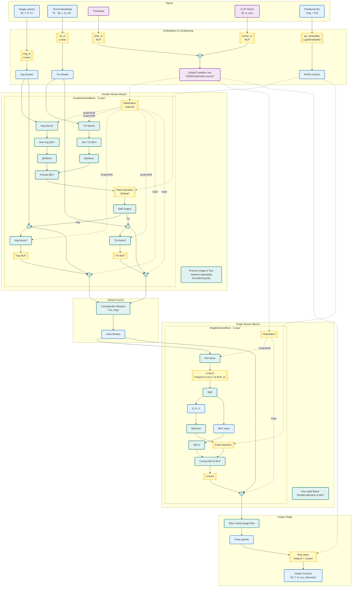

```mermaid
graph TD
    %% クラス定義
    classDef tensor fill:#e3f2fd,stroke:#1565c0,stroke-width:2px,rx:5px
    classDef module fill:#fff9c4,stroke:#fbc02d,stroke-width:2px,rx:5px
    classDef cond fill:#f3e5f5,stroke:#7b1fa2,stroke-width:2px,rx:5px
    classDef process fill:#e0f2f1,stroke:#00695c,stroke-width:2px,rx:5px
    classDef arrow stroke:#555,stroke-width:2px

    %% --- 1. 入力層 ---
    subgraph Inputs [Inputs]
        direction TB
        ImgLatent[Image Latents<br/>（B, T, N, C）]:::tensor
        TxtEmbInput[Text Embeddings<br/>T5 （B, L, D_txt）]:::tensor
        Timesteps[Timesteps]:::cond
        ClipVec[CLIP Vector<br/>（B, D_vec）]:::cond
        PosIDs[Positional IDs<br/>（Img + Txt）]:::tensor
    end

    %% --- 2. 埋め込み層 (Embedders) ---
    subgraph Embeddings [Embedders & Conditioning]
        direction TB
        
        %% Main Stream Embedders
        ImgIn[[img_in<br/>Linear]]:::module
        TxtIn[[txt_in<br/>Linear]]:::module
        ImgLatent --> ImgIn --> ImgStream[Img Stream]:::tensor
        TxtEmbInput --> TxtIn --> TxtStream[Txt Stream]:::tensor

        %% Conditioning Vector Generation
        TimeIn[[time_in<br/>MLP]]:::module
        VecIn[[vector_in<br/>MLP]]:::module
        
        Timesteps --> TimeIn --> VecSum((+)):::process
        ClipVec --> VecIn --> VecSum
        VecSum --> GlobalVec[Global Condition Vec<br/>（Shift/Scale/Gate source）]:::cond

        %% RoPE Embedding
        PEEmbedder[[pe_embedder<br/>LigerEmbedND]]:::module
        PosIDs --> PEEmbedder --> PE[RoPE Cos/Sin]:::tensor
    end

    %% --- 3. Double Stream Blocks ---
    subgraph DoubleStream [Double Stream Blocks]
        direction TB
        Note1[Process Image & Text streams separately<br/>but attend jointly]:::process
        
        subgraph DS_Block [DoubleStreamBlock （Loop）]
            direction TB
            
            %% Modulation
            DS_Mod[[Modulation<br/>（AdaLN）]]:::module
            GlobalVec -.-> DS_Mod
            
            %% Norms
            DS_ImgNorm1[Img Norm1]:::process
            DS_TxtNorm1[Txt Norm1]:::process
            
            DS_Mod -.->|Scale/Shift| DS_ImgNorm1
            DS_Mod -.->|Scale/Shift| DS_TxtNorm1
            
            ImgStream --> DS_ImgNorm1
            TxtStream --> DS_TxtNorm1

            %% QKV Generation
            DS_ImgQKV[Gen Img QKV]:::process
            DS_TxtQKV[Gen Txt QKV]:::process
            
            DS_ImgNorm1 --> DS_ImgQKV --> DS_ImgQKNorm[QKNorm]:::process
            DS_TxtNorm1 --> DS_TxtQKV --> DS_TxtQKNorm[QKNorm]:::process

            %% Joint Attention
            DS_ConcatAttn[Concat QKV]:::process
            DS_FlashAttn[[Flash Attention<br/>（Global）]]:::module
            
            DS_ImgQKNorm & DS_TxtQKNorm --> DS_ConcatAttn
            DS_ConcatAttn --> DS_FlashAttn
            PE -.-> DS_FlashAttn
            
            DS_FlashAttn --> DS_Split[Split Output]:::process
            
            %% Residuals 1
            DS_ImgRes1((+)):::process
            DS_TxtRes1((+)):::process
            
            DS_Split -->|Img| DS_ImgRes1
            DS_Split -->|Txt| DS_TxtRes1
            ImgStream --> DS_ImgRes1
            TxtStream --> DS_TxtRes1

            %% MLPs
            DS_ImgNorm2[Img Norm2]:::process
            DS_TxtNorm2[Txt Norm2]:::process
            DS_ImgMLP[[Img MLP]]:::module
            DS_TxtMLP[[Txt MLP]]:::module
            
            DS_ImgRes1 --> DS_ImgNorm2 --> DS_ImgMLP
            DS_TxtRes1 --> DS_TxtNorm2 --> DS_TxtMLP
            
            DS_Mod -.->|Scale/Shift| DS_ImgNorm2
            DS_Mod -.->|Scale/Shift| DS_TxtNorm2

            %% Residuals 2
            DS_ImgRes2((+)):::process
            DS_TxtRes2((+)):::process
            
            DS_ImgMLP --> DS_ImgRes2
            DS_TxtMLP --> DS_TxtRes2
            DS_ImgRes1 --> DS_ImgRes2
            DS_TxtRes1 --> DS_TxtRes2
            
            DS_Mod -.->|Gate| DS_ImgRes2
            DS_Mod -.->|Gate| DS_TxtRes2
        end
    end

    %% --- 4. Stream Fusion ---
    subgraph Fusion [Stream Fusion]
        ConcatStreams[Concatenate Streams<br/>（Txt, Img）]:::process
        DS_TxtRes2 & DS_ImgRes2 --> ConcatStreams --> JointStream[Joint Stream]:::tensor
    end

    %% --- 5. Single Stream Blocks ---
    subgraph SingleStream [Single Stream Blocks]
        direction TB
        Note2[Flux-style Block:<br/>Parallel Attention & MLP]:::process

        subgraph SS_Block [SingleStreamBlock （Loop）]
            direction TB
            
            %% Modulation
            SS_Mod[[Modulation]]:::module
            GlobalVec -.-> SS_Mod

            %% Pre-Norm
            SS_Norm[Pre-Norm]:::process
            JointStream --> SS_Norm
            SS_Mod -.->|Scale/Shift| SS_Norm

            %% Linear Projection (Fused)
            SS_Linear1[[Linear1<br/>Projects to Q,K,V & MLP_In]]:::module
            SS_Norm --> SS_Linear1 --> SS_Split[Split]:::process

            %% Parallel Branches
            SS_Split --> SS_QKV[Q, K, V]:::tensor
            SS_Split --> SS_MLPIn[MLP Input]:::tensor

            %% Branch 1: Attention
            SS_QKV --> SS_QKNorm[QKNorm]:::process
            SS_QKNorm --> SS_Attn[[Flash Attention]]:::module
            PE -.-> SS_Attn

            %% Branch 2: MLP
            SS_MLPIn --> SS_Act[GELU]:::process

            %% Merge
            SS_Concat[Concat Attn & MLP]:::process
            SS_Attn & SS_Act --> SS_Concat

            %% Output Projection
            SS_Linear2[[Linear2]]:::module
            SS_Concat --> SS_Linear2

            %% Residual
            SS_Res((+)):::process
            SS_Linear2 --> SS_Res
            JointStream --> SS_Res
            SS_Mod -.->|Gate| SS_Res
        end
    end

    %% --- 6. Final Layer & Output ---
    subgraph OutputStage [Output Stage]
        SliceStream[Slice: Keep Image Part]:::process
        SS_Res --> SliceStream --> FinalLatents[Final Latents]:::tensor
        
        FinalLayer[[final_layer<br/>（AdaLN + Linear）]]:::module
        GlobalVec -.-> FinalLayer
        
        FinalLatents --> FinalLayer --> Output[Output Patches<br/>（B, T, N, out_channels）]:::tensor
    end
```