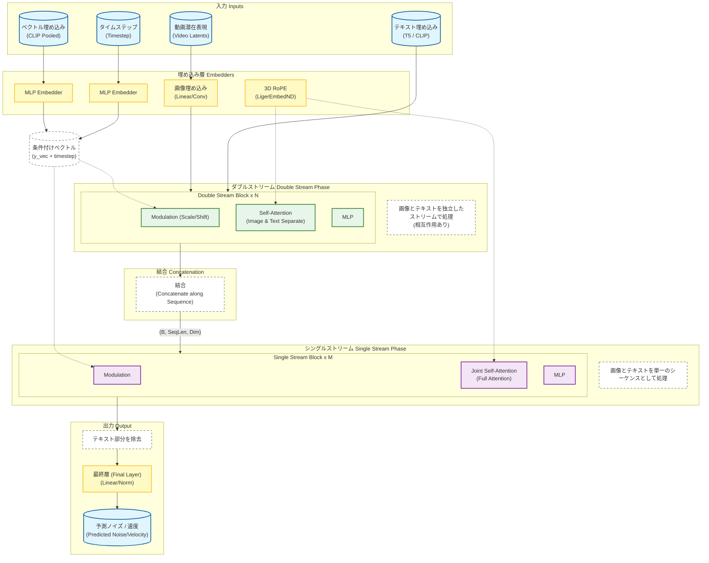

```mermaid
graph TD
    %% ノードのスタイル定義
    classDef input fill:#e1f5fe,stroke:#01579b,stroke-width:2px;
    classDef embed fill:#fff9c4,stroke:#fbc02d,stroke-width:2px;
    classDef double fill:#e8f5e9,stroke:#2e7d32,stroke-width:2px;
    classDef single fill:#f3e5f5,stroke:#7b1fa2,stroke-width:2px;
    classDef op fill:#fff,stroke:#333,stroke-width:1px,stroke-dasharray: 5 5;
    classDef output fill:#e1f5fe,stroke:#01579b,stroke-width:2px;

    subgraph Inputs [入力 Inputs]
        ImgLatent[("動画潜在表現<br/>(Video Latents)")]:::input
        TxtEmbed[("テキスト埋め込み<br/>(T5 / CLIP)")]:::input
        VecEmbed[("ベクトル埋め込み<br/>(CLIP Pooled)")]:::input
        TimeStep[("タイムステップ<br/>(Timestep)")]:::input
    end

    subgraph Embedders [埋め込み層 Embedders]
        ImgIn["画像埋め込み<br/>(Linear/Conv)"]:::embed
        VecIn["MLP Embedder"]:::embed
        TimeIn["MLP Embedder"]:::embed
        PosEmbed["3D RoPE<br/>(LigerEmbedND)"]:::embed
    end

    ImgLatent --> ImgIn
    VecEmbed --> VecIn
    TimeStep --> TimeIn
    
    %% Conditioning
    VecIn --> Cond[("条件付けベクトル<br/>(y_vec + timestep)")]:::op
    TimeIn --> Cond

    subgraph DualStream [ダブルストリーム Double Stream Phase]
        direction TB
        DS_Note["画像とテキストを独立したストリームで処理<br/>(相互作用あり)"]:::op
        
        subgraph DS_Block [Double Stream Block x N]
            DS_Mod["Modulation (Scale/Shift)"]:::double
            DS_Attn["Self-Attention<br/>(Image & Text Separate)"]:::double
            DS_MLP["MLP"]:::double
        end
    end

    ImgIn --> DS_Block
    TxtEmbed --> DS_Block
    Cond -.-> DS_Mod
    PosEmbed -.-> DS_Attn

    subgraph Concat [結合 Concatenation]
        ConcatOp["結合<br/>(Concatenate along Sequence)"]:::op
    end

    DS_Block --> ConcatOp

    subgraph SingleStream [シングルストリーム Single Stream Phase]
        direction TB
        SS_Note["画像とテキストを単一のシーケンスとして処理"]:::op
        
        subgraph SS_Block [Single Stream Block x M]
            SS_Mod["Modulation"]:::single
            SS_Attn["Joint Self-Attention<br/>(Full Attention)"]:::single
            SS_MLP["MLP"]:::single
        end
    end

    ConcatOp -- "(B, SeqLen, Dim)" --> SS_Block
    Cond -.-> SS_Mod
    PosEmbed -.-> SS_Attn

    subgraph Output [出力 Output]
        Split["テキスト部分を除去"]:::op
        FinalLayer["最終層 (Final Layer)<br/>(Linear/Norm)"]:::embed
        PredNoise[("予測ノイズ / 速度<br/>(Predicted Noise/Velocity)")]:::output
    end

    SS_Block --> Split
    Split --> FinalLayer
    FinalLayer --> PredNoise
```